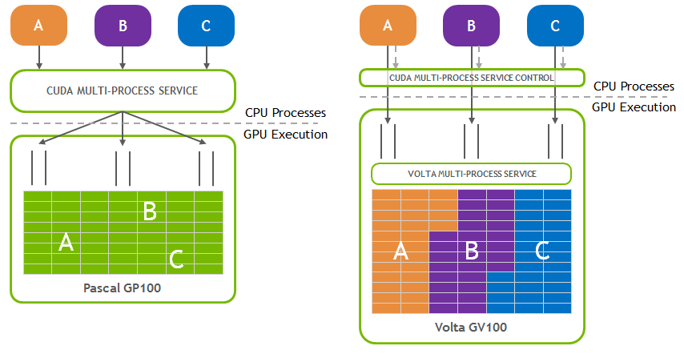
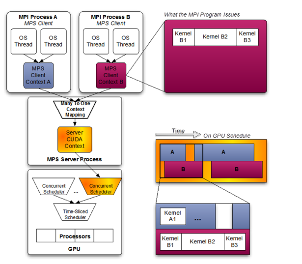
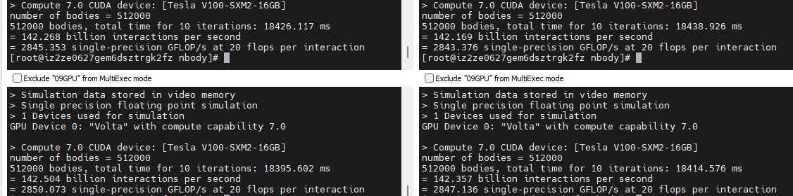
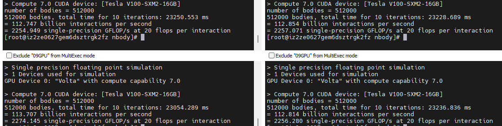
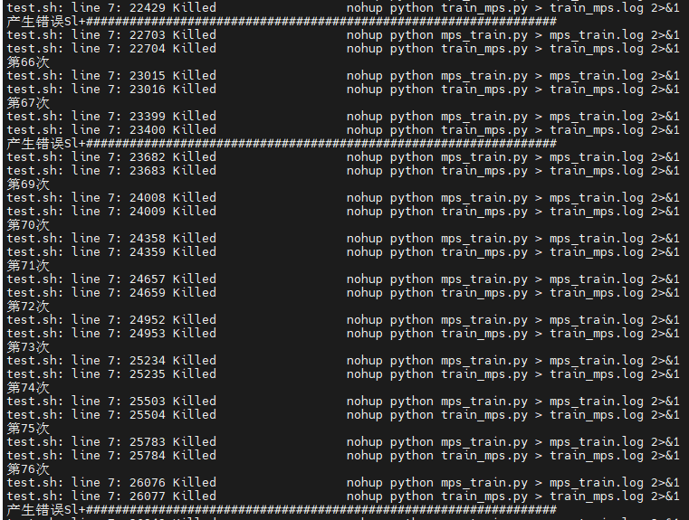
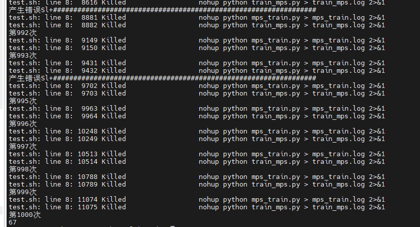
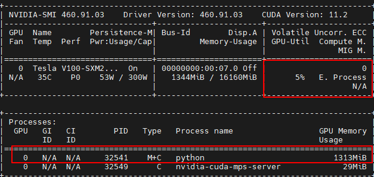
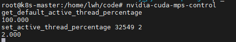
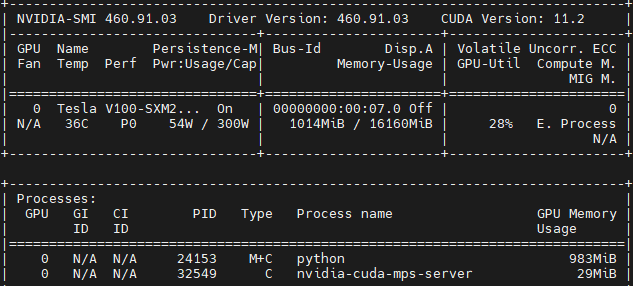

# GPU虚拟化方案MPS调研

### 一、简介

#### 1.基本概念

​	MPS（Multi-Process Service）是 CUDA 应用程序编程接口 (API) 的可替代的二进制兼容实现。是为了透明地支持协作多进程 CUDA 应用程序（通常是MPI程序），原因是为了平衡 CPU 和 GPU 任务之间的工作负载，MPI 进程通常在多核 CPU 机器中分配单独的 CPU 内核，以提供潜在 Amdahl 瓶颈的 CPU 内核并行化。因此，当使用 CUDA 内核加速 MPI 进程时，分配给每个单独 MPI 进程的工作量可能无法充分利用 GPU。虽然每个 MPI 进程最终可能运行得更快，但 GPU 的使用效率很低。多进程服务利用 MPI 级间并行性，提高了整体 GPU 利用率。同时上述情况对其他同时使用GPU的程序也会有一定的提升。

#### 2.版本改进

​	Volta 架构引入了新的 MPS 功能。改善了之前一直被诟病的错误隔离问题。主要有三个地方的改进，如下图介绍



- Volta MPS 客户端直接向 GPU 提交工作，无需通过 MPS 服务器。
- 每个 Volta MPS 客户端都拥有自己的 GPU 地址空间，而不是与所有其他 MPS 客户端共享 GPU 地址空间。
- Volta MPS 支持为服务质量 (QoS) 提供有限的执行资源。

### 二、使用场景

#### 1.优点

- 允许来自不同进程的内核和内存复制操作在 GPU 上重叠，从而实现更高的利用率和更短的运行时间
- MPS 服务器在其所有客户端之间共享一组调度资源，从而消除了 GPU 在这些客户端之间进行调度时的交换开销。
- MPS 服务器分配一份由其所有客户端共享的 GPU 存储和调度资源。·

#### 2.限制

- 仅支持Linux平台，不支持Tegra平台且需要GPU版本大于3.5且CUDA的统一虚拟寻址（UVA）必须可用（一般是默认设置开启的的）
- 系统上同时只有一个用户可以拥有活动的MPS服务器，不同的用户将会排队

#### 3.计算模式

- PROHIBITED -GPU 不可用于计算应用程序。
- EXCLUSIVE_PROCESS- GPU 一次只分配给一个进程，各个进程线程可以同时向 GPU 提交工作。
- DEFAULT - 多个进程可以同时使用 GPU。每个进程的单独线程可以同时向 GPU 提交工作

使用时建议使用EXCLUSIVE_PROCESS模式，确保只有一个MPS服务器在使用。

#### 4.显存保护和错误隔离情况

##### 	4.1显存保护

​	新版本的MPS的客户端已经具有**完全隔离**的GPU地址空间，**在volta之前的版本**会存在几个问题1.CUDA 内核中的越界写入可以修改另一个进程的 CUDA 可访问内存状态，并且不会触发错误。2.CUDA 内核中的超出范围读取可以访问由另一个进程修改的 CUDA 可访问显存，并且不会触发错误，从而导致未定义的行为。同时这些问题不是由于CUDAAPI访问越界造成，而是在内核中指针进行显存访问造成，MPS本身会限制诸如cudaMemcpy()访问其他MPS客户端的显存。

##### 	4.2有限的错误隔离

​	由Volta MPS 客户端进程生成的致命 GPU 异常  将包含在具有致命异常导致 GPU 的所有客户端之间共享的 GPU 子集中。而其他GPU上运行的客户端不受此影响。致命GPU异常包括几个方面：

- 内存故障，将记录故障信息为客户端的PID

- 设备ID

- 客户端ID，每个受到影响的客户端的状态变为“不活动”

  ##### 4.3.提前终止

  不支持通过CTRL-C 或信号终止 MPS 客户端。

#### 5.多GPU系统

##### 	5.1连接限制

​	Volta MPS 服务器支持每个设备 48 个客户端 CUDA 上下文。这些上下文可能分布在多个进程中。如果超过连接限制，CUDA 应用程序将无法创建 CUDA 上下文并从 cuCtxCreate() 或触发上下文创建的第一个 CUDA 运行时 API 调用返回 API 错误。MPS 服务器将记录失败的连接尝试。

##### 	5.2资源配置

​	主要是为了实现两个要求：减少客户端内存占用和提高 QoS；为了实现这两个要求，有两种机制：活动线程百分比和编程接口。

- 活动线程百分比（都可以通过设备属性cudaDevAttrMultiProcessorCount）

  - 统一设置
    - MPS 控制实用程序提供了 2 组命令来设置/查询所有未来 MPS 客户端的限制。
    - 通过设置环境变量来设置所有未来 MPS 客户端的限制CUDA_MPS_ACTIVE_THREAD_PERCENTAGE 用于 MPS 控制过程。
    - 可以通过单独设置环境变量来进一步限制新客户端的限制CUDA_MPS_ACTIVE_THREAD_PERCENTAGE 对客户端进程进行限制
  - 非统一设置，通过设置环境变量CUDA_MPS_ACTIVE_THREAD_PERCENTAGE和CUDA_MPS_ENABLE_PER_CTX_DEVICE_MULTIPROCESSOR_PARTITIONING来限制MPS客户端的可用线程。

- 编程分区约束

  通过cuCtxCreate_v3()创建的客户端 CUDA 上下文配置的CUexecAffinity参数它指定上下文限制使用的 SM 数量。上下文的执行限制可以通过查询cuCtxGetExecAffinity()。有**四种分配策略**：**一种常见的配置策略**是将可用线程均匀地分配给每个 MPS 客户端进程（即，将活动线程百分比设置为 100%/n，对于 n 个预期的 MPS 客户端进程）；**更优化的策略**是将部分均匀划分为预期客户端数量的一半（即设置活动线程百分比为 100% / 0.5n），以便在有空闲资源时让负载均衡器更自由地在客户端之间重叠执行。**接近最佳的供应策略**是根据每个 MPS 客户端的工作负载对可用线程进行非均匀分区（即，如果客户端 1 的比率为客户端 1，则将活动线程百分比设置为 30%，将客户端 2 的活动线程百分比设置为 70%工作量和 client2 工作量为 30%: 70%)；**最佳供应策略**是在知道每个客户端的执行资源需求的情况下，精确地限制每个 MPS 客户端使用的 SM 数量。

### 三、架构及实验

#### 	1.架构

​	

​	由上图可以看出，同一时刻可以有多个kernel同时在运行

#### 	2.实验

​	首先看一下如何使用MPS，然后通过下述几个实验查看MPS对CUDA运算的提升情况，

​	**使用MPS的命令**

```shell
man nvidia-cuda-mps-control # 描述此实用程序的用法。
nvidia-cuda-mps-control -d # 在后台进程中启动守护进程。
ps-ef | grep mps # 查看 MPS 守护进程是否正在运行。
echo quit  | nvidia-cuda-mps-control # 关闭守护进程。
nvidia-cuda-mps-control -f # 在前台启动 deamon
```

​	**用于MPS控制的命令**

- get_device_client_list [<PID>]-- 这列出了枚举此设备的客户端应用程序的设备和 PID。它可选择采用服务器实例 PID。

- set_default_active_thread_percentage <百分比>-- 这会覆盖 MPS 服务器的默认活动线程百分比。如果已经有一个服务器生成，这个命令只会影响下一个服务器。如果执行退出命令，设置值将丢失。默认值为 100。

- get_default_active_thread_percentage-- 查询当前默认可用线程百分比。

- set_active_thread_percentage <PID> <百分比>-- 这将覆盖给定 PID 的 MPS 服务器实例的活动线程百分比。之后使用该服务器创建的所有客户端都将遵守新限制。现有客户不受影响。

- get_active_thread_percentage <PID>-- 查询给定PID的MPS服务器实例的当前可用线程百分比。

- set_default_device_pinned_mem_limit <dev> <value>

  -- 这为每个 MPS 客户端设置默认设备固定内存限制。如果已经有一个服务器生成，这个命令只会影响下一个服务器。如果执行退出命令，设置值将丢失。该值必须采用整数形式，后跟限定符“G”或“M”，分别指定以千兆字节或兆字节为单位的值。例如：为了将设备 0 的限制设置为 10 GB，使用的命令是：

  ```
  set_default_device_pinned_mem_limit 0 10G。
  ```

- 默认情况下内存限制是禁用的。

- get_default_device_pinned_mem_limit <dev>-- 查询设备的当前默认固定内存限制。

- set_device_pinned_mem_limit <PID> <dev> <值>-- 这会覆盖 MPS 服务器的设备固定内存限制。这将为设备开发人员的给定 PID 的 MPS 服务器实例的每个客户端设置设备固定内存限制。之后使用该服务器创建的所有客户端都将遵守新限制。现有客户不受影响。为设备 0 的 pid 1024 的服务器设置内存限制为 900MB 的示例用法。

- set_device_pinned_mem_limit 1024 0 900M, get_device_pinned_mem_limit <PID> <dev>-- 查询设备 dev 的给定 PID 的 MPS 服务器实例的当前设备固定内存限制。

- 每个节点只能运行一个 nvidia-cuda-mps-control 守护进程实例。


- terminate_client <服务器 PID> <客户端 PID>-- 终止在 <server PID> 表示的 MPS 服务器上运行的 MPS 客户端进程 <client PID> 的所有未完成的 GPU 工作。终止在 PID 为 123 的 MPS 服务器上运行的 PID 为 1024 的 MPS 客户端进程的未完成 GPU 工作的示例用法：terminate_client 123 1024

  **与MPS状态显示有关的命令**

```shell
man nvidia-smi # 描述此实用程序的用法。
nvidia-smi -L # 列出节点上的 GPU。
nvidia-smi -q # 列出 GPU 状态和配置信息。
nvidia-smi -q -d compute # 显示每个 GPU 的计算模式。
nvidia-smi -i 0 -c EXCLUSIVE_PROCESS # 将 GPU 0 设置为独占模式，以 root 身份运行。
nvidia-smi -i 0 -c DEFAULT # 将 GPU 0 设置为默认模式，以 root 身份运行。（共享进程）
nvidia-smi -i 0 -r # 使用新设置重启 GPU 0。
```


##### 	2.1使用nbody测试

​	开启MPS

​	

​	未开启MPS



​	由上述可以看出对于nobody(512000)时间减少了20%左右

##### 	2.2 使用深度学习进行错误隔离测试

​	一百次测试，产生八次错误错误类型都为Sl+（处于后台休眠状态的多线程）



​	一千次测试，产生67次错误，错误类型都为Sl+



​	经过多次测试，错误影响都在百分之6上下。同时都是造成其他进程处于休眠状态，需要重新启动。
##### 	2.4 活动线程调度实验（设置可用线程会把客户提交的工作集中到一组SM中，实现有限的错误隔离）

​	首先是默认情况下可以看到相对活动显存来说，利用率比较低，显存占用1313M
  


​	之后开启活动线程限制,可以看到相对于活动线程来说，利用率大幅度提高，显存占用略有降低，于此同时带来的是训练时间上的增加


